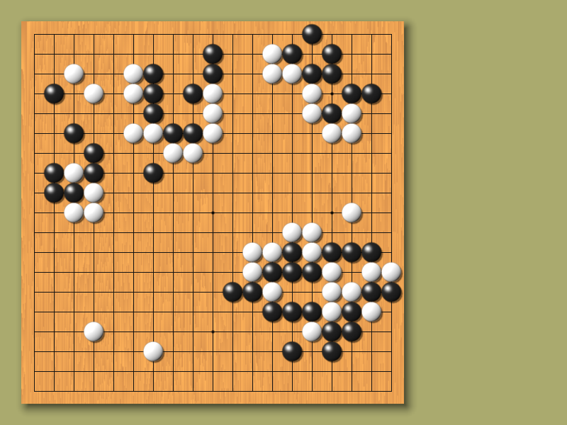

# Siv3D-Go
第 3 回 Siv3D Game Jam (テーマ「プログラムだけで碁盤と碁石を描く」) 参加作品

#### 作者  
Reputeless (https://twitter.com/Reputeless)



#### 説明  
碁盤の模様: Perlin Noise
碁石: レイトレーシングで球を描いた Image

#### コード  
```cpp
# include <Siv3D.hpp>

const Size offset(30, 30);
const Size padding(18, 18);
const int32 blockSize = 28;
const Rect goban(offset, 18 * Size(blockSize, blockSize) + padding * 2);

Point GetPos(const Point& xy)
{
	return offset + padding + xy * blockSize;
}

Image CreateGoban()
{
	PerlinNoise noise;
	return Image(800, 800, [&](const Point& p)
	{
		const double x = Fraction(noise.octaveNoise0_1(p * Vec2(0.03, 0.0002), 2) * 25) * 0.15 + 0.85;
		return ColorF(x, 0.7 * Pow(x, 1.3), 0.35 *x);
	}).gaussianBlurred(1, 1).scaled(goban.size);
}

Image CreateStone(bool black)
{
	const Vec4 sphere(0, 0, 1.5, 1.0);
	const Vec3 lightDir = Vec3(-1, 1, -1).normalized();

	return Image(200, 200, [=](const Point& p)
	{
		const Vec3 dir = Vec3(p.x / 100.0 - 1.0, p.y / -100.0 +1.0, 1.0).normalized();	
		const double B = -sphere.xyz().dot(dir);
		const double D = B * B - (sphere.xyz().dot(sphere.xyz()) - (sphere.w * sphere.w));

		if (D > 0.0)
		{
			const double t = -B - Sqrt(D);

			if (t > 0.0)
			{
				const Vec3 pos = dir * t;
				const Vec3 normal = (pos - sphere.xyz()).normalized();		
				const Vec3 half = (lightDir - pos.normalized()).normalized();
				const double diffuse = Max(normal.dot(lightDir), 0.0) * (black ? 0.02 : 1.5);
				const double specular = Pow(Max(normal.dot(half), 0.0), 32);
				return ColorF(Pow(diffuse + specular, 1.0 / 2.2));
			}
		}

		return ColorF(black ? 0.0 : 0.5, 0.0);
	}).scaled(0.158);
}

void Main()
{
	Window::Resize(800, 600);
	Graphics::SetBackground(Color(170, 170, 110));
	const Texture textureGoban(CreateGoban());
	const Texture textureBlack(CreateStone(true));
	const Texture textureWhite(CreateStone(false));
	Grid<int32> stones(19, 19, 0);

	while (System::Update())
	{
		goban.drawShadow({ 6, 6 }, 20, 5);
		goban(textureGoban).draw();

		for (auto i : step(19))
		{
			Line(GetPos({ 0, i }), GetPos({ 18, i })).moveBy(0.5, 0.5).draw(Color(20));
			Line(GetPos({ i, 0 }), GetPos({ i, 18 })).moveBy(0.5, 0.5).draw(Color(20));
		}

		for (auto x : { 3, 9, 15 })
		{
			for (auto y : { 3, 9, 15 })
			{
				Circle(GetPos({ x, y }), 2.1).moveBy(0.5, 0.5).draw(Color(0));
			}
		}

		for (auto p : step({ 19,19 }))
		{
			if (const int32 stone = stones[p])
			{
				Circle(GetPos(p), 13).drawShadow({ 2.5, 2.5 }, 3, 1);
				(stone == 1 ? textureBlack : textureWhite).drawAt(GetPos(p));
			}
		}

		const Point pp((Mouse::Pos() - offset - (Size(blockSize, blockSize) - padding) / 2) / blockSize);

		if (stones.inBounds(pp.y, pp.x))
		{
			if (!stones[pp])
			{
				Circle(GetPos(pp), 13).moveBy(0.5, 0.5).drawFrame(5, 0, Color(255, 0, 40, 127));
			}

			if (Input::MouseL.clicked)
			{
				stones[pp] = (stones[pp] != 1);
			}
			else if (Input::MouseR.clicked)
			{
				stones[pp] = (stones[pp] != 2) * 2;
			}
		}
	}
}
```
